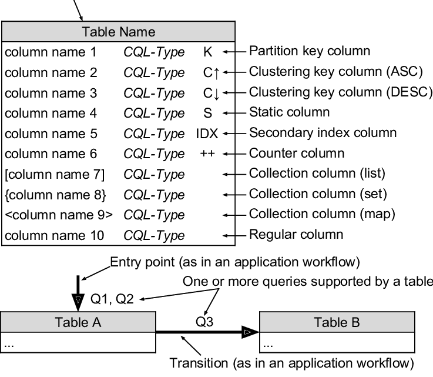
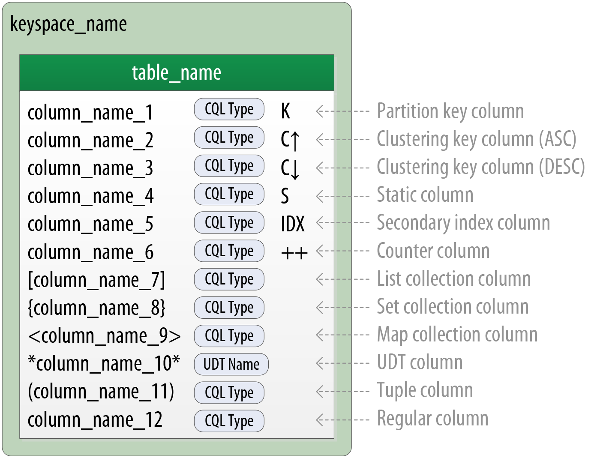

# 📚 Guia de Estudo — NoSQL (6 semanas)

## Sumário

- [Visão geral](#visão-geral)
- [Pré-requisitos](#pré-requisitos)
- [Semana 1 — Fundamentos de NoSQL](#semana-1---fundamentos-de-nosql)
- [Semana 2 — Document Stores (MongoDB)](#semana-2---document-stores-mongodb)
- [Semana 3 — Key-Value e Wide-Column](#semana-3---key-value-e-wide-column)
- [Semana 4 — Grafos e Busca](#semana-4---grafos-e-busca)
- [Semana 5 — Time Series e Observabilidade](#semana-5---time-series-e-observabilidade)
- [Semana 6 — Integração e Projeto Final](#semana-6---integração-e-projeto-final)
- [Recursos / Referências](#recursos--referências)

---

## Visão geral

Plano de estudo de 6 semanas para aprender conceitos e práticas com bancos NoSQL: motivos para usar NoSQL, princípios de modelagem, tipos de bancos (document, key-value, wide-column, graph, time-series, search) e exercícios práticos com Docker e drivers (C# ou Python).

---

## Pré-requisitos

- Docker e Docker Compose
- .NET SDK (opcional, para exemplos em C#) ou Python 3.x
- Conhecimentos básicos de bancos relacionais e linha de comando

---

## Semana 1 — Fundamentos de NoSQL

### Objetivo
Entender por que usar NoSQL e os princípios básicos de modelagem.

### Teoria
- Limitações do modelo relacional em escala
- CAP theorem: Consistência, Disponibilidade e Tolerância a Particionamento
- Tipos de bancos NoSQL: Document, Key-Value, Wide-Column, Graph, Time-Series, Search
- Princípios de modelagem NoSQL: query-driven, agregados, chaves de partição, denormalização

### Prática
- Subir containers com Docker (MongoDB e Redis)
  - Exemplo:
    ```bash
    docker run -d --name mongodb -p 27017:27017 mongo:6
    docker run -d --name redis -p 6379:6379 redis:7
    ```
- Criar dados simples: usuários, sessões, produtos
- Fazer consultas básicas via CLI (mongo shell / redis-cli) e via driver (C# ou Python)

### Entregável
- Resumo comparando SQL vs NoSQL
- Diagrama com diferenças entre tipos de NoSQL

    #### Quando faz sentido usar NoSQL
    Faz sentido utilizar NoSQL quando se precisa de performance, escala horizontal e/ou flexibilidade de schema. Enquanto bancos SQL escalam verticalmente, NoSQL foi projetado para escala horizontal, adicionando nós comuns (sharding). Mesmo que SQL suporte replicação, a busca por consistência forte (ACID) pode gerar atraso na propagação. Já o NoSQL normalmente adota BASE (Basically Available, Soft State, Eventual Consistency), aceitando consistência eventual em troca de disponibilidade.

    #### Teorema CAP
    O Teorema CAP mostra que não é possível ter Consistência, Disponibilidade e Tolerância a Partição ao mesmo tempo em falhas. Na prática:
    - CP (ex.: HBase): garante consistência, mas pode negar requisições.
    - AP (ex.: Cassandra, DynamoDB): garante disponibilidade, mas pode entregar dado atrasado.
    - CA só existe em sistemas centralizados (não distribuídos).

    #### Tipos de NoSQL
    - Document: dados agregados, lidos juntos (e-commerce, SaaS).
    - Key-Value: consultas simples, rápidas, em memória (cache, sessão).
    - Wide-Column:  escrita massiva, séries temporais, atenção à chave (logs, IoT).
    - Graph: foco nos relacionamentos (redes sociais, fraude, recomendações).
    - Time Series: dados indexados por tempo, métricas e monitoramento (IoT, finanças, infra).
    - Search: busca full-text e relevância (e-commerce, logs, analytics).


```yaml
# docker-compose example for local dev (save as docker-compose.yml)
version: '3.8'

services:
  mongo:
    image: mongo:7
    container_name: mongo
    ports:
      - "27017:27017"
    volumes:
      - mongo_data:/data/db
    healthcheck:
      test: ["CMD-SHELL", "mongosh --quiet --eval \"db.runCommand({ ping: 1 })\""]
      interval: 5s
      timeout: 3s
      retries: 10

  redis:
    image: redis:7
    container_name: redis
    ports:
      - "6379:6379"
    command: ["redis-server", "--appendonly", "yes"]
    volumes:
      - redis_data:/data
    healthcheck:
      test: ["CMD", "redis-cli", "ping"]
      interval: 5s
      timeout: 3s
      retries: 10

volumes:
  mongo_data:
  redis_data:
```

Salve o trecho acima em um arquivo `docker-compose.yml` e inicie com `docker compose up -d`.

---

## Semana 2 — Document Stores (MongoDB)

### Objetivo
Dominar modelagem com documentos e agregados.

### Teoria
- Embedding vs referencing
- Índices e limitações (ex.: 16 MB por documento no MongoDB)
- Evolução de schema e versionamento de documento

### Prática
- Subir MongoDB com volume via Docker
- Modelar um cenário de e‑commerce: Clientes, Pedidos (com itens embedded)
- Consultas de exemplo: todos pedidos de um cliente, total gasto
- Inserir dados via script (C# com MongoDB.Driver ou Python)

### Entregável
- Comparar duas modelagens (normalizada vs embed) e medir performance das queries


---

## Semana 3 — Key-Value e Wide-Column

### Objetivo
Entender bancos de lookup rápido e tratamento de séries/volume massivo de dados.

### Teoria
- Redis como cache e store de sessão
- Cassandra: partição, clustering key e modelagem orientada a queries
- Hotspotting e práticas para evitar desequilíbrio de dados
- Diagrama [Chebotko](https://www.linkedin.com/in/artemchebotko/) para modelagem no Cassandra. Criado por Artem Chebotko


- [Post](https://www.notion.so/jonatan2m/NoSQL-data-Modeling-Data-modeling-in-Cassandra-27c982fcdffa81f69d99d79d942291af) falando sobre modelagem
### Prática
- Subir Redis e Cassandra com Docker
- Redis: salvar sessões (por ex. userId -> token com TTL)
- Cassandra: modelar tabela pedidos_por_cliente e consultar últimos N pedidos

### Entregável
- Análise de trade-offs entre Redis e Cassandra para casos de uso similares

```yaml
# docker-compose snippet (Redis + Cassandra)
version: '3.8'

services:
  redis:
    image: redis:7
    container_name: redis
    ports:
      - "6379:6379"
    command: ["redis-server", "--appendonly", "yes"]
    volumes:
      - redis_data:/data
    healthcheck:
      test: ["CMD", "redis-cli", "ping"]
      interval: 5s
      timeout: 3s
      retries: 10

  cassandra:
    image: cassandra:5
    container_name: cassandra
    ports:
      - "9042:9042"
    environment:
      MAX_HEAP_SIZE: 512M
      HEAP_NEWSIZE: 256M
    volumes:
      - cass_data:/var/lib/cassandra
    healthcheck:
      test: ["CMD-SHELL", "cqlsh -e 'SHOW HOST' 127.0.0.1 9042 || exit 1"]
      interval: 10s
      timeout: 5s
      retries: 20

volumes:
  redis_data:
  cass_data:
```

Salve em `docker-compose.yml` e inicie com:

```bash
docker compose up -d
```

---

## Semana 4 — Grafos e Busca

### Objetivo
Conhecer bancos para relações complexas (grafos) e busca full-text.

### Teoria
- Modelagem em grafos: nós e arestas, propriedades e padrões de consulta (caminhos, vizinhança)
- Busca full-text: inverted index, ranking e relevância

### Prática
- Subir Neo4j e Elasticsearch com Docker
- Neo4j: modelar rede social (Usuário — segue → Usuário), consultar amigos em comum e caminho mais curto
- Elasticsearch: indexar produtos (nome/descrição) e testar buscas por relevância

### Entregável
- Comparativo: quando usar grafos vs document store + search

```yaml
# docker-compose snippet (Neo4j + Elasticsearch)
version: '3.8'

services:
  neo4j:
    image: neo4j:5
    container_name: neo4j
    ports:
      - "7474:7474"   # HTTP
      - "7687:7687"   # Bolt
    environment:
      NEO4J_AUTH: "neo4j/teste123"
    volumes:
      - neo4j_data:/data
    # healthcheck: adicionar se a imagem incluir curl ou outra ferramenta de checagem

  elasticsearch:
    image: docker.elastic.co/elasticsearch/elasticsearch:8.14.3
    container_name: elasticsearch
    environment:
      discovery.type: "single-node"
      xpack.security.enabled: "false"
      ES_JAVA_OPTS: "-Xms512m -Xmx512m"
    ports:
      - "9200:9200"
    volumes:
      - es_data:/usr/share/elasticsearch/data
    # Observação: a imagem oficial pode não incluir curl; adapte healthcheck localmente se desejar

volumes:
  neo4j_data:
  es_data:
```

Salve em `docker-compose.yml` e inicie com:

```bash
docker compose up -d
```

---

## Semana 5 — Time Series e Observabilidade

### Objetivo
Trabalhar com dados com dimensão temporal e criar dashboards simples.

### Teoria
- Diferenças de bancos de séries temporais (InfluxDB, Prometheus)
- Agregações por janelas: sliding, tumbling, resampling

### Prática
- Subir InfluxDB e Grafana via Docker
- Simular métricas (ex.: CPU) enviando pontos a cada segundo
- Consultas de exemplo: média móvel, percentil P95 em 1 minuto
- Criar painel simples no Grafana

### Entregável
- Análise de série temporal com gráfico (CPU/latência)

```yaml
# docker-compose snippet (InfluxDB + Grafana)
version: '3.8'

services:
  influxdb:
    image: influxdb:2.7
    container_name: influxdb
    ports:
      - "8086:8086"
    environment:
      DOCKER_INFLUXDB_INIT_MODE: "setup"
      DOCKER_INFLUXDB_INIT_USERNAME: "admin"
      DOCKER_INFLUXDB_INIT_PASSWORD: "admin123"
      DOCKER_INFLUXDB_INIT_ORG: "lab"
      DOCKER_INFLUXDB_INIT_BUCKET: "metrics"
      DOCKER_INFLUXDB_INIT_ADMIN_TOKEN: "meu-token"
    volumes:
      - influx_data:/var/lib/influxdb2
    healthcheck:
      test: ["CMD-SHELL", "curl -fsS http://localhost:8086/health || exit 1"]
      interval: 10s
      timeout: 5s
      retries: 6

  grafana:
    image: grafana/grafana:11.1.0
    container_name: grafana
    ports:
      - "3000:3000"
    environment:
      GF_SECURITY_ADMIN_USER: "admin"
      GF_SECURITY_ADMIN_PASSWORD: "admin123"
    volumes:
      - grafana_data:/var/lib/grafana
    depends_on:
      - influxdb

volumes:
  influx_data:
  grafana_data:
```

Salve em `docker-compose.yml` e inicie com:

```bash
# inicia os serviços em background
docker compose up -d

# ver logs
docker compose logs -f influxdb grafana
```

---

## Semana 6 — Integração e Projeto Final

### Objetivo
Consolidar aprendizados e montar uma arquitetura usando múltiplos bancos (polyglot persistence).

### Teoria
- Estratégias de Polyglot Persistence: qual banco para cada responsabilidade
- Padrões de integração entre sistemas (sincronização, eventos, CQRS quando aplicável)

### Prática
- Montar um mini-sistema (CLI ou uma API simples) que usa:
  - MongoDB: catálogo e perfis.
  - Redis: sessão/autorização e cache de “trending”
  - Elasticsearch: busca por título/descrição
  - Cassandra: histórico de visualização (por usuário, ordenado por data).
- Implementar queries reais: histórico por usuário, busca por título, catálogo

### Roteiro mínimo do app

- Seed: insira 50 filmes no Mongo, indexe no Elasticsearch.
- Login: gere uma “sessão” no Redis (session:{userId} -> jwt)
- Busca: pesquise filmes no Elasticsearch; detalhes vêm do Mongo (cache em Redis por 60s).
- Assistir: ao “assistir”, grave evento no Cassandra (historico_por_usuario).
- Minhas últimas N: leia do Cassandra (LIMIT) e mostre.

### Entregável final
- Relatório (Markdown): Desenho lógico (qual banco para quê, e por quê).
- Esquemas/índices/chaves.
- 3 queries críticas de cada tecnologia.
- Lições aprendidas (trade-offs e gargalos que encontrou).


---

## Recursos / Referências

- Documentação oficial: MongoDB, Redis, Cassandra, Neo4j, InfluxDB, Elasticsearch
- Artigos sobre CAP theorem, modelagem NoSQL e padrões de design

---

Boas práticas: mantenha os exemplos pequenos, documente as consultas que motivam cada escolha de modelagem e foque em casos de uso reais.